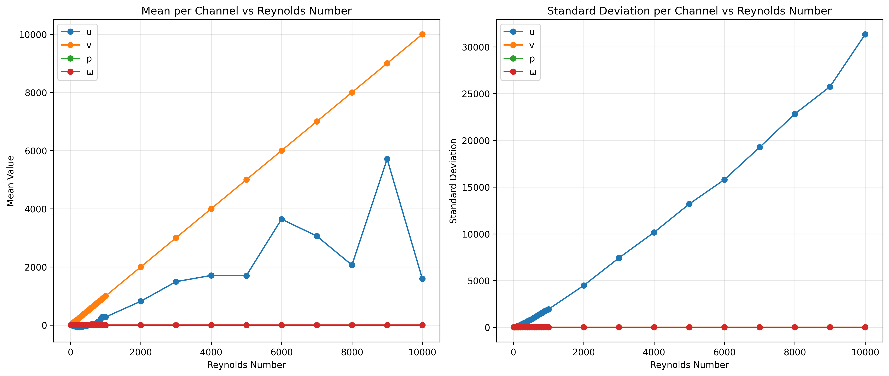
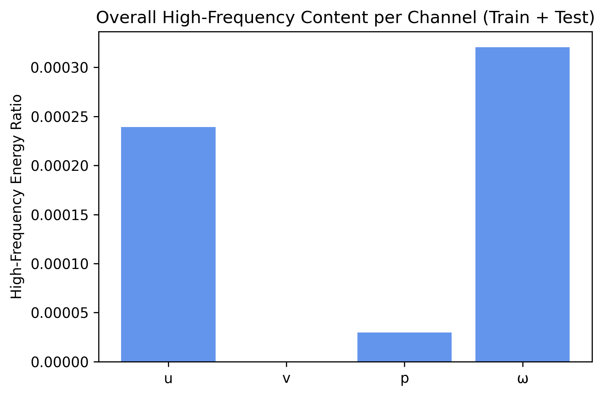

# Data Folder
## Purpose
This folder stores all datasets used in the project. It includes the downloaded Navier–Stokes simulation files, in the `/DATA/NavierStokes` folder, used for model training and evaluation. The preprocessing scripts remove vertical velocity channel to reduce dimensionality while retaining the features necessary for reconstruction modeling.

# Metadata

## Data Summary
The project uses a 2D turbulent fluid-flow dataset generated from numerical Navier–Stokes simulations. Each file originally contains four physical channels across 39 time steps. All data files have the same shape:
- Shape: (T, C, H, W) = (39 time steps, 4 channels, 128 height, 256 width)
    - T: Time Steps: the number of frames in each simulation sequence (39). Each frame captures the state of the fluid at one moment in time
    - C: Channels: The number of physical variables recorded per frame (4 total: u, v, p, ω)
    - H: Height: The vertical spatial resolution of the simulation grid (128 pixels)
    - W: Width: The horizontal spatial resolution of the simulation grid (256 pixels)
- Raw channels:
    - u: horizontal velocity
    - v: vertical velocity
    - p: pressure
    - ω: vorticity (how much the fluid is rotating)

Exploratory analysis showed that the v channel contributes minimal high-frequency structure and exhibits negligible variation across flow regimes. Because of this limited informational value, the v channel is removed during preprocessing.

Data are stored in `.npy` format.

## Provenance
The dataset originates from the PARCv2 project released on Zenodo, which provides physics-based fluid simulations for research on spatiotemporal modeling. All data were generated via numerical solvers, not real-world measurements. The training and test folders in the release are distinct and were used as provided to avoid leakage.
Source: Zenodo record 13909869 https://zenodo.org/records/13909869

## License

The dataset is distributed under CC BY 4.0, permitting reuse and modification with attribution. Associated code in the PARCv2 repository is licensed under MIT. These licenses allow unrestricted research use when authors are credited.

## Ethical Statements

There are no human subjects or privacy concerns. The main ethical consideration is accurate reporting of reconstruction results and avoiding claims beyond simulated environments. Dataset usage requires acknowledging simulation limits and refraining from overstating physical realism.

## Data Dictionary
Below is the data dictionary describing the different channels in the Navier Stokes dataset:
| Channel | Field | Description                                          | Type    |
| ------- | ----- | ---------------------------------------------------- | ------- |
| 0       | u     | horizontal velocity                                  | float32 |
| 1       | v     | vertical velocity                                    | float32 |
| 2       | p     | pressure                                             | float32 |
| 3       | ω     | vorticity                                            | float32 |

## Explanatory Plots
### Mean and Standard Deviation per Channel vs Reynolds Number

This figure summarizes how both the mean (average values) and the standard deviation (variability) of each fluid channel change as the Reynolds number increases. The left plot shows that the velocity components (u and v) increase sharply with Re, reflecting stronger and faster flow as turbulence develops, while pressure and vorticity (p and ω) remain near zero, indicating symmetric fluctuations rather than a directional trend. The right plot shows only the u grows significantly with Re, suggesting that most of the turbulent intensity in the dataset is expressed through fluctuations in the x-direction velocity field, while v, p, and  ω remain nearly constant with minimal variance. Together, these patterns confirm the physical consistency of the dataset and highlight that turbulence-driven variability is concentrated primarily in u, whereas the other channels encode smaller-scale, more stable fluctuations that will still contribute important structural information for the autoencoder’s reconstruction.

### Overall High-Frequency Content per Channel

This chart shows how much fine detail, or high-frequency content, each channel contained in the dataset. The u channel and the ω channel have the highest ratios, which means they carry many sharp edges, rapid fluctuations, and small-scale structures that are characteristic of turbulent motion. The v channel has almost no high-frequency content, which reflects the fact that it varies very little across the simulations. The p channel has only a small amount of high-frequency energy, indicating that its variations are smoother and change more gradually. Overall, the chart highlights that most of the intricate, rapidly changing patterns in the dataset appear in the u and ω channels, while v and p remain much smoother and less detailed.

